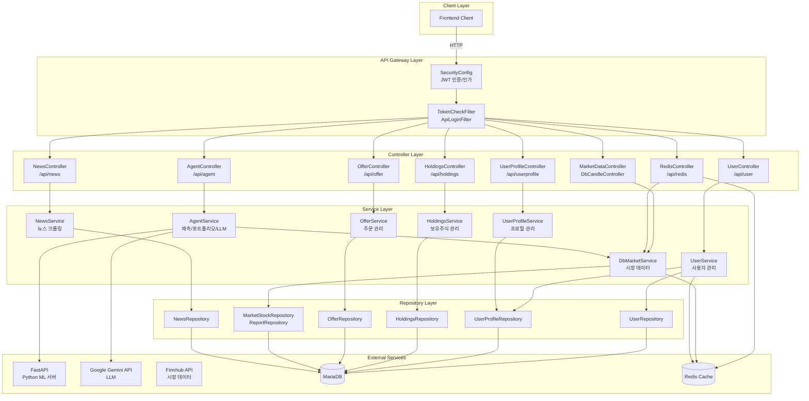
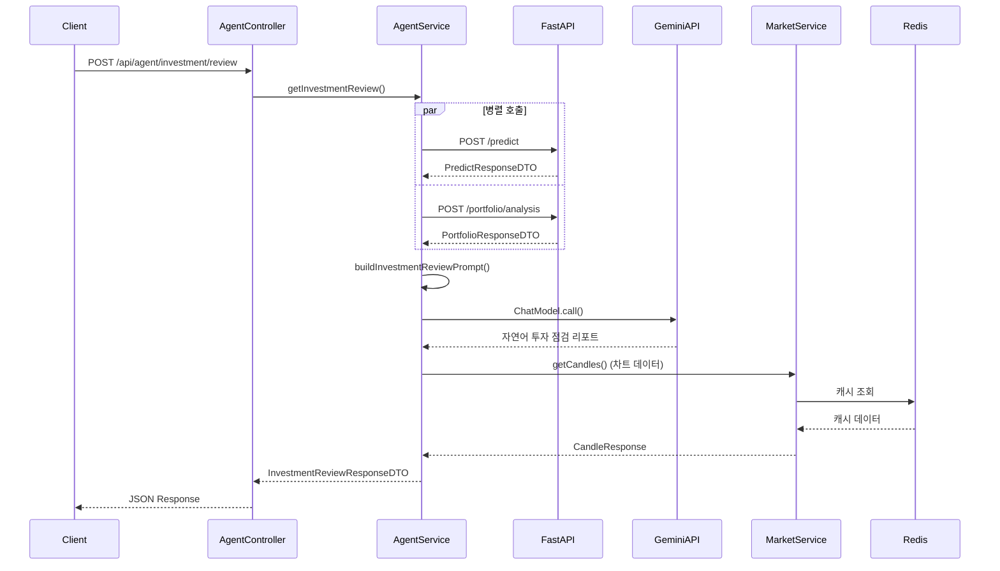
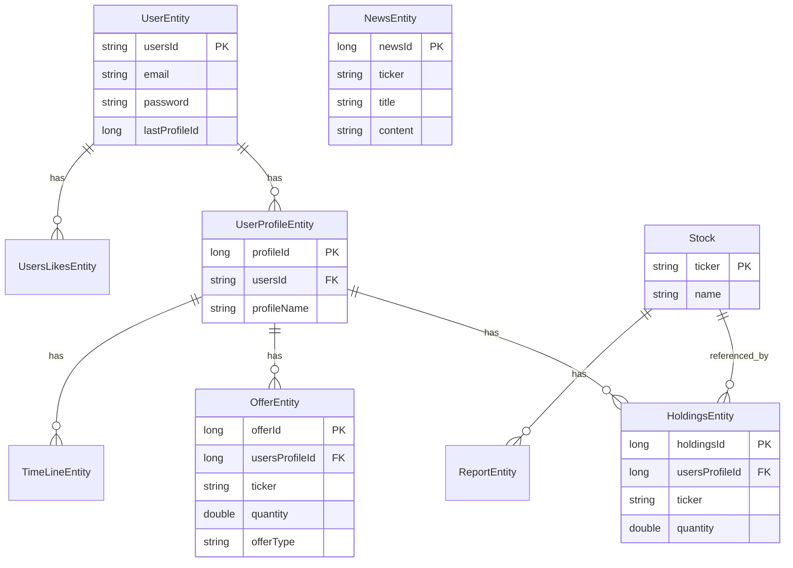
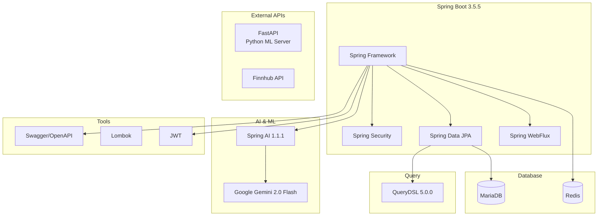

# StockSimulator-BE 프로젝트 구조도

## 전체 시스템 아키텍처



## 패키지 구조 상세도

```mermaid
graph LR
    subgraph "team.shdsesc.stocksimul"
        subgraph "agent 패키지"
            AC[AgentController]
            AS[AgentService]
            ADTO[Predict/Portfolio DTOs]
            AS -->|uses| ChatModel[ChatModel<br/>Spring AI]
        end
        
        subgraph "auth 패키지"
            AF[ApiLoginFilter<br/>TokenCheckFilter]
            AH[Login Handlers]
            AJ[JwtTokenProvider]
        end
        
        subgraph "user 패키지"
            UC[UserController]
            US[UserService]
            UE[UserEntity]
            UR[UserRepository]
        end
        
        subgraph "userprofile 패키지"
            PC[UserProfileController]
            PS[UserProfileService]
            PE[UserProfileEntity]
            PR[UserProfileRepository]
        end
        
        subgraph "holdings 패키지"
            HC[HoldingsController]
            HS[HoldingsService]
            HE[HoldingsEntity]
            HR[HoldingsRepository]
        end
        
        subgraph "order 패키지"
            OC[OfferController]
            OS[OfferService]
            OE[OfferEntity]
            OR[OfferRepository]
        end
        
        subgraph "market 패키지"
            MC[MarketDataController<br/>DbCandleController]
            MS[DbMarketService]
            ME[Stock Entity<br/>Report Entity]
            MR[MarketStockRepository<br/>ReportRepository]
        end
        
        subgraph "news 패키지"
            NC[NewsController]
            NS[NewsService]
            NE[NewsEntity]
            NR[NewsRepository]
        end
        
        subgraph "redis 패키지"
            RC[RedisController]
            RDAO[StockRedisDAO<br/>RedisDAO]
        end
        
        subgraph "config 패키지"
            SC[SecurityConfig]
            QC[QueryDslConfig]
            RC2[RedisConfig]
            SWC[SwaggerConfig]
        end
    end
    
    AC --> AS
    UC --> US
    PC --> PS
    HC --> HS
    OC --> OS
    MC --> MS
    NC --> NS
    RC --> RDAO
    
    US --> UR
    PS --> PR
    HS --> HR
    OS --> OR
    MS --> MR
    NS --> NR
    
    AS --> MS
    AS --> ChatModel
```



## 데이터 흐름도 - 투자 점검 API



## 엔티티 관계도



## 기술 스택 구조



## 주요 API 엔드포인트

```mermaid
graph LR
    subgraph "인증/인가"
        A1[POST /api/auth/login]
        A2[POST /api/user/register]
        A3[POST /api/user/logout]
        A4[GET /api/user/me]
    end
    
    subgraph "AI 에이전트"
        B1[POST /api/agent/predict]
        B2[POST /api/agent/portfolio/analysis]
        B3[POST /api/agent/investment/review]
    end
    
    subgraph "사용자 프로필"
        C1[GET /api/userprofile/profiles/{email}]
        C2[GET /api/userprofile/profile/{pid}]
        C3[POST /api/userprofile/create]
        C4[PUT /api/userprofile/update]
    end
    
    subgraph "보유 주식"
        D1[GET /api/holdings/{profileId}]
        D2[POST /api/holdings]
        D3[PUT /api/holdings]
    end
    
    subgraph "주문"
        E1[POST /api/offer/update]
        E2[GET /api/offer/history/{usersProfileId}]
    end
    
    subgraph "시장 데이터"
        F1[GET /api/market/candles]
        F2[GET /api/market/symbols]
        F3[GET /api/market/tickers]
    end
    
    subgraph "뉴스"
        G1[GET /api/news/{ticker}]
    end
    
    subgraph "Redis"
        H1[GET /api/redis/status]
        H2[POST /api/redis/start]
        H3[POST /api/redis/stop]
    end
```
